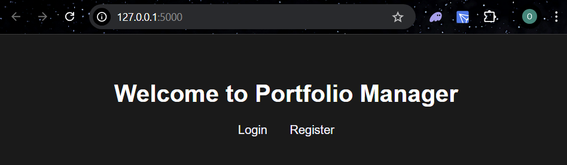
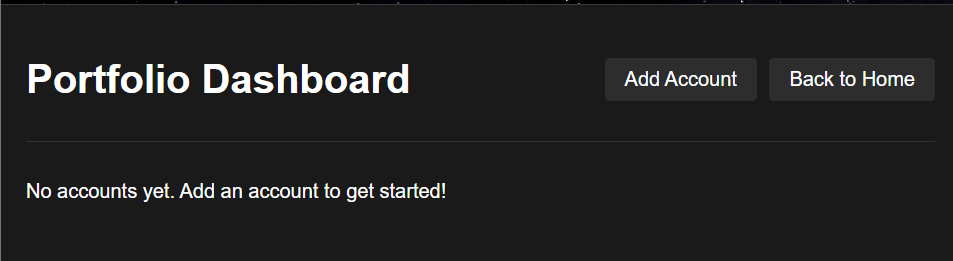
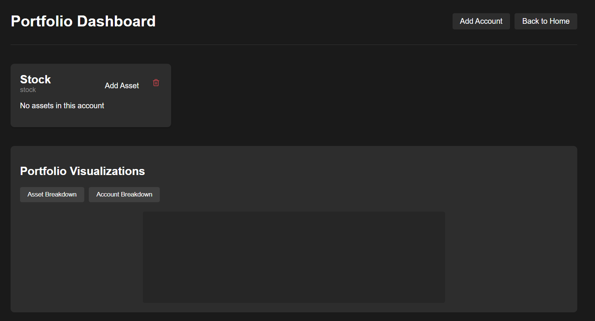
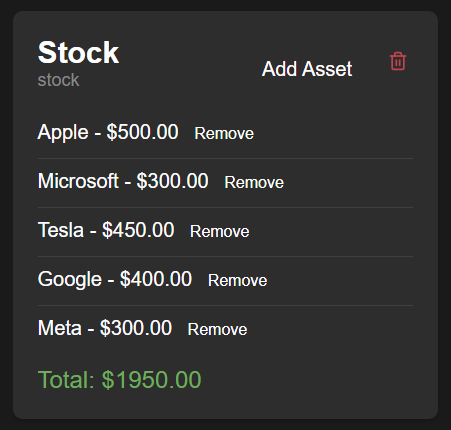
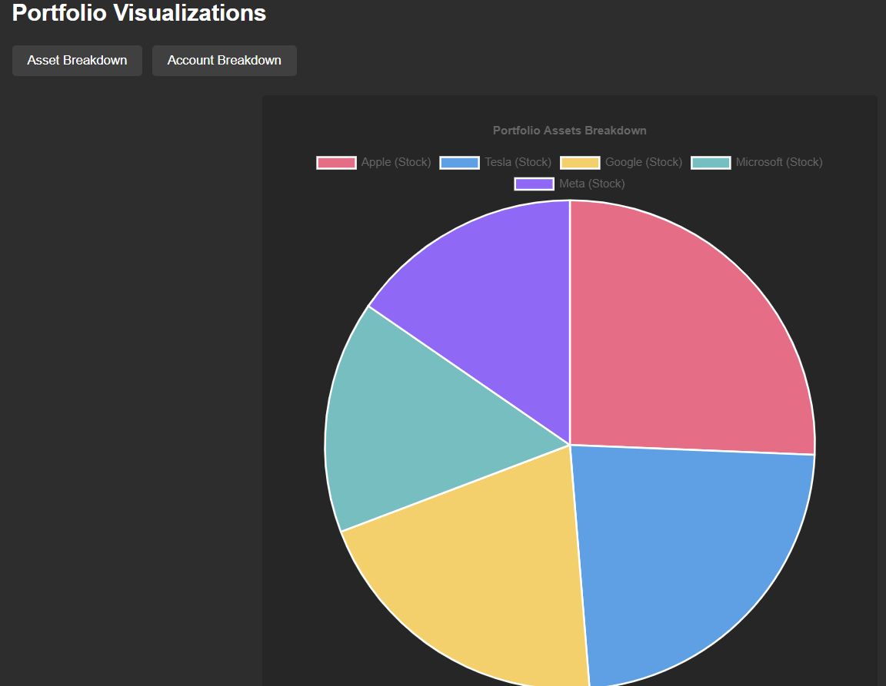

# Personal Finance Web Application

## Overview

A web application that allows users to manage their financial portfolio, including stocks, real estate, cryptocurrency, and bank accounts. The system uses OOP principles for data organization and PostgreSQL for data persistence.

## Project Structure
```
project_root/
│
├── app/
│   ├── __init__.py          # Flask application initialization
│   ├── routes/              # API endpoints
│   │   ├── __init__.py
│   │   └── auth_routes.py   # Authentication routes
│   │
│   ├── database/            # Database management
│   │   ├── __init__.py
│   │   ├── db_connection.py # Database singleton
│   │   |__ db_setup.sql     # SQL script to setup DB
|   |   |__ clear_db.sql     # SQL script to clear DB
│   │
│   ├── models/             # Backend class logic
│   │   ├── __init__.py
│   │   ├── user.py        # User model
│   │   ├── portfolio.py   # Portfolio model
│   │   ├── account.py     # Account models
│   │   └── asset.py       # Asset models
│   │
│   ├── factories/         # Factory pattern implementation
│   │   ├── __init__.py
│   │   ├── account_factory.py
│   │   └── asset_factory.py
|   |   
|   |__ visualizations
|   |   |__ strategies     # Strategy pattern w/ visualization strategies
│   │
│   └── templates/         # HTML templates
│       ├── auth/
│       │   ├── login.html
│       │   └── register.html
|       |
|       |__ portfolio
|       |  |__ ...         # Templates for portfolio page
|       |   
│       └── home.html
│
├── config.py              # Configuration settings
└── run.py                # Application entry point
|__ requirements.txt
```

## OOP Design

Classes are organized as follows:

1. User class - Manages user authentication and portfolio interactions
2. Portfolio class - Contains and manages multiple account types
3. Account classes:

- Abstract Account base class
- StockAccount - For managing stock investments
- CryptoAccount - For managing cryptocurrency
- BankAccount - Base class for banking accounts

4. Asset classes:

- Abstract Asset base class
- Stock - Represents individual stock holdings
- Crypto - Represents cryptocurrency holdings
- Cash - Represents cash holdings

A User object owns a singular Portfolio by composition. Then, the Portfolio can be populated by User created Accounts. Once an Account is created, a User defined Asset can be added to the Account. All actions are handled by the User class.

User flow:
```
Home Page → View Portfolio → Add Account → Add Asset
                ↑_______________←______________↲
```


## Design Patterns Used

1. Factory Method Pattern - for Asset and Account creation
2. Strategy Pattern - to handle visualization stategies
3. Singleton Pattern - for DB manager


## Database Schema

Uses PostgreSQL with the following structure:

- Users table - Stores user information and authentication
- Portfolios table - Links portfolios to users
- Accounts table - Stores different types of financial accounts
- Assets table - Stores assets with their respective types and values

## Current Features

1. User Authentication
2. Account Management
3. Database Integration
4. Basic Web Interface

## Installation and Setup

1. Clone this repository
2. Install Requirements:

        pip install -r requirements.txt

3. Setup PostgreSQL database:
    - Using pgadmin, Create DB called 'portfolio_management'
    - Navigate to servers -> databases -> portfolio_management. Right click and select 'Query Tool'
    - In the Query Tool, paste the SQL script located at app/database/db_setup.sql and execute the script. This will setup the database schema.

4. Update config file and change DB_PASSWORD to your database password

5. Run Application

        python run.py

6. To clear database, run app/database/clear_db.sql in database query tools (see step 3)

## Example Usage:

Step 1: Login or Register



Step 2: Add Account to Portfolio



Step 3: Add Account(s)



Step 4: Add Assets to Account and Visualize





## Next Steps:

1. Add Real Time Stock Prices Integration