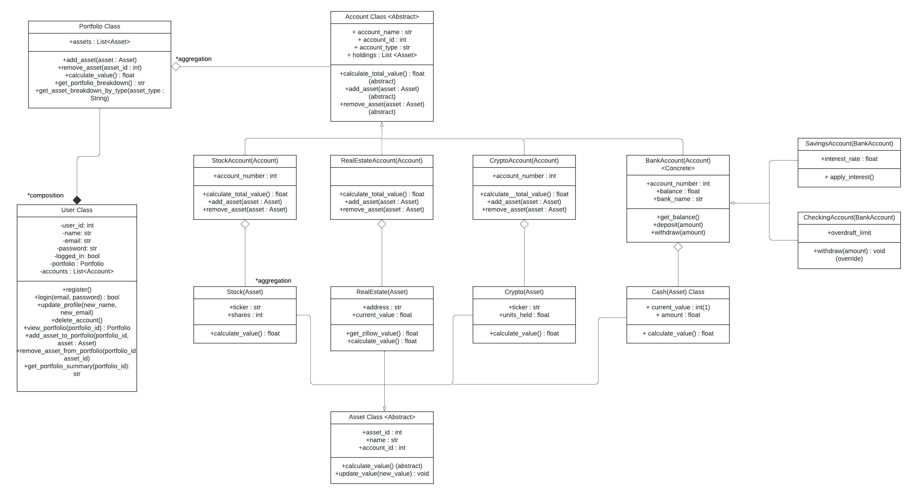

# Personal Finance Web Application

## Proposal

The idea is for a system which allows users to create accounts before entering information
pertaining to stock portfolios, real estate, crypto, etc. while processing and organizing this data
via OOP logic. The focus for the mini project would be on the OOP portion for working with the
various categories of financial data. For instance, a class of for stock portfolios along with an
interface class for stocks which are then employed for specific company stocks being added to
the system to effectively allow for efficient scaling to consider more companies without altering
the base logic. The additional areas of financial data would be handled in an analogous manner
with specific alterations to handle the unique nature of each category. As we move to build this,
it is highly probable this will be expanded upon with the specific implementation of OOP being
adapted as we progress into the project.

## OOP Design

Classes are broken down into the following

1. User class - user object that interacts with app. Handles all actions such as adding accounts, adding assets, etc.
2. Portfolio class - portfolio that stores accounts created by User
3. Account parent class (abstract), with following subclasses 
    - StockAccount
    - RealEstateAccount
    - CryptoAccount
    - BankAccount
4. Asset parent class (abstract), with following subclasses
    - Stock
    - RealEstate
    - Crypto
    - Cash
5. AccountFactory - for account creation
6. AssetFactory - for asset creation
7. Interface class - CLI for user interaction
8. DBManager class (singleton) - not yet implemented

A User object owns a singular Portfolio by composition. Then, the Portfolio can be populated by User created Accounts. Once an Account is created, a User defined Asset can be added to the Account. All actions are handled by the User class.

## Installation and running

To run this application, simply clone the repository and run the following command:

        python main.py

This calls the main_loop in the command line interface, which shows the programs functionality.

## Current Working Features for Mini Project

1. Register User
2. Create Account
3. Add Assets to Account
4. View Portfolio

## Design Patterns Used

1. Factory Method Pattern - for Asset and Account creation
2. Composition - exists between Portfolio and User objects
3. Aggregation - exists between Assets and Accounts, as well as Accounts and Portfolio
4. Singleton Patter - for DB manager (not yet implemented)

## Features to Implement for Final Project

1. Database Integration (PostgreSQL)
2. User friendly UI
3. API integration for calculating real time stock, crypto, and real estate prices
4. Better Error Handling (i.e., don't allow user to add asset to non-existent account)

